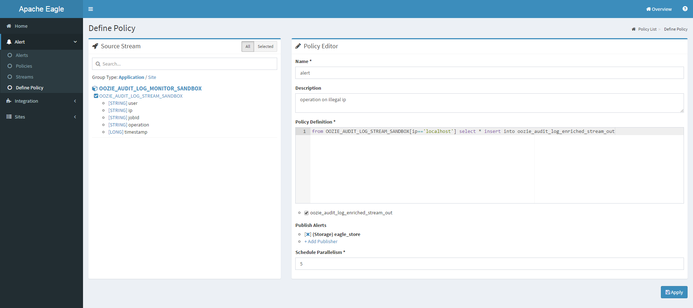
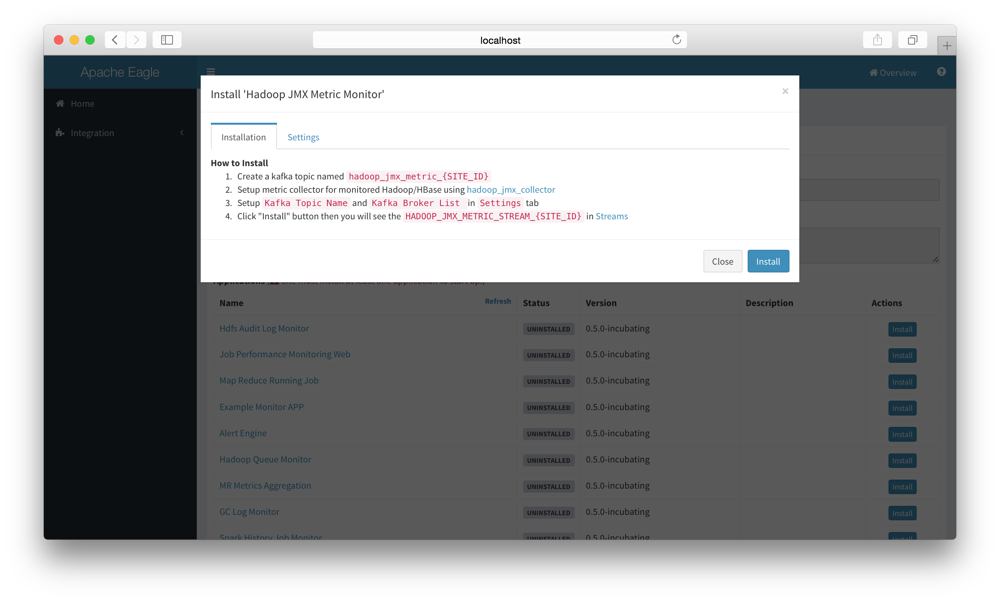
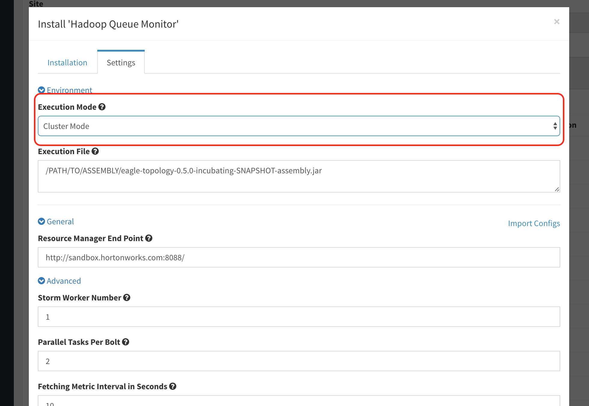

# HDFS Data Activity Monitoring

## Monitor Requirements

This application aims to monitor user activities on HDFS via the hdfs audit log. Once any abnormal user activity is detected, an alert is sent in several seconds. The whole pipeline of this application is

* Kafka ingest: this application consumes data from Kafka. In other words, users have to stream the log into Kafka first. 

* Data re-procesing, which includes raw log parser, ip zone joiner, sensitivity information joiner. 

* Kafka sink: parsed data will flows into Kafka again, which will be consumed by the alert engine. 

* Policy evaluation: the alert engine (hosted in Alert Engine app) evaluates each data event to check if the data violate the user defined policy. An alert is generated if the data matches the policy.


## Setup & Installation

* Choose a site to install this application. For example 'sandbox'

* Install "Hdfs Audit Log Monitor" app step by step

    

    

    


## How to collect the log

To collect the raw audit log on namenode servers, a log collector is needed. Users can choose any tools they like. There are some common solutions available: [logstash](https://www.elastic.co/guide/en/logstash/current/getting-started-with-logstash.html), [filebeat](https://www.elastic.co/guide/en/beats/filebeat/current/filebeat-getting-started.html), log4j appender, etcs. 

For detailed instruction, refer to: [How to stream audit log into Kafka](using-eagle/#how-to-stream-audit-log-into-kafka)

## Sample policies

### 1. monitor file/folder operations 

Delete a file/folder on HDFS. 

```
from HDFS_AUDIT_LOG_ENRICHED_STREAM_SANDBOX[str:contains(src,'/tmp/test/subtest') and ((cmd=='rename' and str:contains(dst, '.Trash')) or cmd=='delete')] select * group by user insert into hdfs_audit_log_enriched_stream_out
```

HDFS_AUDIT_LOG_ENRICHED_STREAM_SANDBOX is the input stream name, and hdfs_audit_log_enriched_stream_out is the output stream name, the content between [] is the monitoring conditions. `cmd`, `src` and `dst` is the fields of hdfs audit logs.

   

### 2. classify the file/folder on HDFS

Users may want to mark some folders/files on HDFS as sensitive content. For example, by marking '/sys/soj' as "SOJ", users can monitor any operations they care about on 'sys/soj' and its subfolders/files.

```
from HDFS_AUDIT_LOG_ENRICHED_STREAM_SANDBOX[sensitivityType=='SOJ' and cmd=='delete')] select * group by user insert into hdfs_audit_log_enriched_stream_out
```
The example policy monitors the 'delete' operation on files/subfolders under /sys/soj. 

### 3. Classify the IP Zone 

In some cases, the ips are classified into different zones. For some zone, it may have higher secrecy. Eagle providers ways to monitor user activities on IP level. 

```
from HDFS_AUDIT_LOG_ENRICHED_STREAM_SANDBOX[securityZone=='SECURITY' and cmd=='delete')] select * group by user insert into hdfs_audit_log_enriched_stream_out
```

The example policy monitors the 'delete' operation on hosts in 'SECURITY' zone. 

## Questions on this application

---
# OOZIE Data Activity Monitoring
 
## Monitor Requirements

This application aims to monitor user activities on OOZIE via the oozie audit log. Once any abnormal user activity is detected, an alert is sent in several seconds. The whole pipeline of this application is

* Kafka ingest: this application consumes data from Kafka. In other words, users have to stream the log into Kafka first. 

* Data re-procesing, which includes raw log parser, sensitivity information joiner. 

* Kafka sink: parsed data will flows into Kafka again, which will be consumed by the alert engine. 

* Policy evaluation: the alert engine (hosted in Alert Engine app) evaluates each data event to check if the data violate the user defined policy. An alert is generated if the data matches the policy.


## Setup & Installation

* Choose a site to install this application. For example 'sandbox'

* Install "Oozie Audit Log Monitor" app step by step

    

    

    


## How to collect the log

To collect the raw audit log on namenode servers, a log collector is needed. Users can choose any tools they like. There are some common solutions available: [logstash](https://www.elastic.co/guide/en/logstash/current/getting-started-with-logstash.html), [filebeat](https://www.elastic.co/guide/en/beats/filebeat/current/filebeat-getting-started.html), log4j appender, etcs. 

For detailed instruction, refer to: [How to stream audit log into Kafka](using-eagle/#how-to-stream-audit-log-into-kafka)

## Sample policies

### 1. monitor file/folder operations 

Delete a file/folder on HDFS. 

```
from OOZIE_AUDIT_LOG_STREAM_SANDBOX[ip=='localhost'] select * insert into oozie_audit_log_enriched_stream_out
```

OOZIE_AUDIT_LOG_STREAM_SANDBOX is the input stream name, and oozie_audit_log_enriched_stream_out is the output stream name, the content between [] is the monitoring conditions. `user`, `ip`, `jobId`, `operation` and `timestamp` is the fields of oozie audit logs.

   

### 2. classify the file/folder on OOZIE

Users may want to mark some jobId on OOZIE as sensitive job. For example, by marking '0000101-161115152703493-oozie-oozi-C' as "BASE", users can monitor any operations they care about on these jobId.

```
from OOZIE_AUDIT_LOG_STREAM_SANDBOX[sensitivityType=='BASE' and cmd=='kill')] select * group by user insert into oozie_audit_log_enriched_stream_out
```
The example policy monitors the 'kill' operation on jobId under "BASE". 

# Questions on this application

---


# JMX Monitoring

* Application "**HADOOP_JMX_METRIC_MONITOR**" provide embedded collector script to ingest hadoop/hbase jmx metric as eagle stream and provide ability to define alert policy and detect anomaly in real-time from metric.

    |   Fields   ||
    | :---: | :---: |
    | **Type**    | *HADOOP_JMX_METRIC_MONITOR* |
    | **Version** | *0.5.0-version* |
    | **Description** | *Collect JMX Metric and monitor in real-time* |
    | **Streams** | *HADOOP_JMX_METRIC_STREAM* |
    | **Configuration** | *JMX Metric Kafka Topic (default: hadoop_jmx_metric_{SITE_ID})*<br/><br/>*Kafka Broker List (default: localhost:6667)* |

## Setup & Installation

* Make sure already setup a site (here use a demo site named "sandbox").

* Install "Hadoop JMX Monitor" app in eagle server.

    

* Configure Application settings.

    

* Ensure a kafka topic named hadoop_jmx_metric_{SITE_ID} (In current guide, it should be hadoop_jmx_metric_sandbox)

* Setup metric collector for monitored Hadoop/HBase using hadoop_jmx_collector and modify the configuration.

    * Collector scripts: [hadoop_jmx_collector](https://github.com/apache/incubator-eagle/tree/master/eagle-external/hadoop_jmx_collector)

    * Rename config-sample.json to config.json: [config-sample.json](https://github.com/apache/incubator-eagle/blob/master/eagle-external/hadoop_jmx_collector/config-sample.json)

            {
                env: {
                    site: "sandbox",
                    name_node: {
                        hosts: [
                            "sandbox.hortonworks.com"
                        ],
                        port: 50070,
                        https: false
                    },
                    resource_manager: {
                        hosts: [
                            "sandbox.hortonworks.com"
                        ],
                        port: 50030,
                        https: false
                    }
                },
                inputs: [{
                    component: "namenode",
                    host: "server.eagle.apache.org",
                    port: "50070",
                    https: false,
                    kafka_topic: "nn_jmx_metric_sandbox"
                }, {
                    component: "resourcemanager",
                    host: "server.eagle.apache.org",
                    port: "8088",
                    https: false,
                    kafka_topic: "rm_jmx_metric_sandbox"
                }, {
                    component: "datanode",
                    host: "server.eagle.apache.org",
                    port: "50075",
                    https: false,
                    kafka_topic: "dn_jmx_metric_sandbox"
                }],
                filter: {
                    monitoring.group.selected: [
                        "hadoop",
                        "java.lang"
                    ]
                },
                output: {
                    kafka: {
                        brokerList: [
                            "localhost:9092"
                        ]
                    }
                }
            }


* Click "Install" button then you will see the HADOOP_JMX_METRIC_STREAM_{SITE_ID} in Streams.

    

## Define JMX Alert Policy

1. Go to "Define Policy".

2. Select HADOOP_JMX_METRIC_MONITOR related streams.

3. Define SQL-Like policy, for example

        from HADOOP_JMX_METRIC_STREAM_SANDBOX[metric=="cpu.usage" and value > 0.9]
        select site,host,component,value
        insert into HADOOP_CPU_USAGE_GT_90_ALERT;

    As seen in below screenshot:


## Stream Schema

* Schema

    | Stream Name | Stream Schema | Time Series |
    | :---------: | :-----------: | :---------: |
    | HADOOP_JMX_METRIC_MONITOR | **host**: STRING<br/><br/>**timestamp**: LONG<br/><br/>**metric**: STRING<br/><br/>**component**: STRING<br/><br/>**site**: STRING<br/><br/>**value**: DOUBLE | True |

## Metrics List

* Please refer to the [Hadoop JMX Metrics List](hadoop-jmx-metrics-list.txt) and see which metrics you're interested in.

---

# Job Performance Monitoring

## Monitor Requirements

* Finished/Running Job Details
* Job Metrics(Job Counter/Statistics) Aggregation
* Alerts(Job failure/Job slow)

## Applications

* Application Table

    | application | responsibility |
    | :---: | :---: |
    | Map Reduce History Job Monitoring | parse mr history job logs from hdfs |
    | Map Reduce Running Job Monitoring | get mr running job details from resource manager |
    | Map Reduce Metrics Aggregation | aggregate metrics generated by applications above |

## Data Ingestion And Process

* We build storm topology to fulfill requirements for each application.

    

* Map Reduce History Job Monitoring (Figure 1)
    * **Read Spout**
        * read/parse history job logs from HDFS and flush to eagle service(storage is Hbase)
    * **Sink Bolt**
        * convert parsed jobs to streams and write to data sink
* Map Reduce Running Job Monitoring (Figure 2)
    * **Read Spout**
        * fetch running job list from resource manager and emit to Parse Bolt
    * **Parse Bolt**
        * for each running job, fetch job detail/job counter/job configure/tasks from resource manager
* Map Reduce Metrics Aggregation (Figure 3)
    * **Divide Spout**
        * divide time period(need to be aggregated) to small pieces and emit to Aggregate Bolt
    * **Aggregate Bolt**
        * aggregate metrics for given time period received from Divide Spout

## Setup & Installation
* Make sure already setup a site (here use a demo site named "sandbox").

* Install "Map Reduce History Job" app in eagle server(Take this application as an example).

* Configure Application settings

    

* Ensure a kafka topic named {SITE_ID}_map_reduce_failed_job (In current guide, it should be sandbox_map_reduce_failed_job) will be created.

* Click "Install" button then you will see the MAP_REDUCE_FAILED_JOB_STREAM_{SITE_ID} in Alert->Streams.
    
  This application will write stream data to kafka topic(created by last step)
  
## Integration With Alert Engine

In order to integrate applications with alert engine and send alerts, follow below steps(Take Map Reduce History Job application as an example):

* **define stream and configure data sink**
    * define stream in resource/META-INF/providers/xxxProviders.xml
    For example, MAP_REDUCE_FAILED_JOB_STREAM_{SITE_ID}
    * configure data sink
    For example, create kafka topic {SITE_ID}_map_reduce_failed_job

* **define policy**

For example, if you want to receive map reduce job failure alerts, you can define policies (SiddhiQL) as the following:
```sql
from map_reduce_failed_job_stream[site=="sandbox" and currentState=="FAILED"]
select site, queue, user, jobType, jobId, submissionTime, trackingUrl, startTime, endTime
group by jobId insert into map_reduce_failed_job_stream_out
```
    
   
   
* **view alerts**

You can view alerts in Alert->alerts page.

## Stream Schema
All columns above are predefined in stream map_reduce_failed_job_stream defined in

    eagle-jpm/eagle-jpm-mr-history/src/main/resources/META-INF/providers/org.apache.eagle.jpm.mr.history.MRHistoryJobApplicationProvider.xml

Then, enable the policy in web ui after it's created. Eagle will schedule it automatically.

---

# Topology Health Check

* Application "TOPOLOGY HEALTH CHECK" aims to monior those servies with a master-slave structured topology and provide metrics at host level.

    |   Fields   ||
    | :---: | :---: |
    | **Type**    | *TOPOLOGY_HEALTH_CHECK* |
    | **Version** | *0.5.0-version* |
    | **Description** | *Collect MR,HBASE,HDFS node status and cluster ratio* |
    | **Streams** | *TOPOLOGY_HEALTH_CHECK_STREAM* |
    | **Configuration** | *Topology Health Check Topic (default: topology_health_check)*<br/><br/>*Kafka Broker List (default: sandobox.hortonworks.com:6667)* |

## Setup & Installation

* Make sure already setup a site (here use a demo site named "sandbox").

* Install "Topology Health Check" app in eagle server.

    

* Configure Application settings.

    

* Ensure the existence of a kafka topic named topology_health_check (In current guide, it should be topology_health_check).

* Click "Install" button then you will see the TOPOLOGY_HEALTH_CHECK_STREAM_{SITE_ID} on "Streams" page (Streams could be navigated in left-nav).

    

## Define Health Check Alert Policy

* Go to "Define Policy".

* Select TOPOLOGY_HEALTH_CHECK related streams.

* Define SQL-Like policy, for example

        from TOPOLOGY_HEALTH_CHECK_STREAM_SANDBOX[status=='dead'] select * insert into topology_health_check_stream_out;

    

---

# Hadoop Queue Monitoring

* This application collects metrics of Resource Manager in the following aspects:

    * Scheduler Info of the cluster: http://{RM_HTTP_ADDRESS}:{PORT}/ws/v1/cluster/scheduler

    * Applications of the cluster: http://{RM_HTTP_ADDRESS}:{PORT}/ws/v1/cluster/apps

    * Overall metrics of the cluster: http://{RM_HTTP_ADDRESS}:{PORT}/ws/v1/cluster/metrics

            by version 0.5-incubating, mainly focusing at metrics
             - `appsPending`
             - `allocatedMB`
             - `totalMB`
             - `availableMB`
             - `reservedMB`
             - `allocatedVirtualCores`.

## Setup & Installation

* Make sure already setup a site (here use a demo site named "sandbox").

* From left-nav list, navigate to application managing page by "**Integration**" > "**Sites**", and hit link "**sandbox**" on right.

    

* Install "Hadoop Queue Monitor" by clicking "install" button of the application.

    

* In the pop-up layout, select running mode as `Local` or `Cluster`.

    

* Set the target jar of eagle's topology assembly that has existed in eagle server, indicating the absolute path ot it. As in the following screenshot:

    

* Set Resource Manager endpoint urls field, separate values with comma if there are more than 1 url (e.g. a secondary node for HA).

    

* Set fields "**Storm Worker Number**", "**Parallel Tasks Per Bolt**", and "**Fetching Metric Interval in Seconds**", or leave them as default if they fit your needs.

    

* Finally, hit "**Install**" button to complete it.

## Use of the application

* There is no need to define policies for this applicatoin to work, it could be integrated with "**Job Performance Monitoring Web**" application and consequently seen on cluster dashboard, as long as the latter application is installed too. See an exmple in the following screenshot:

    
