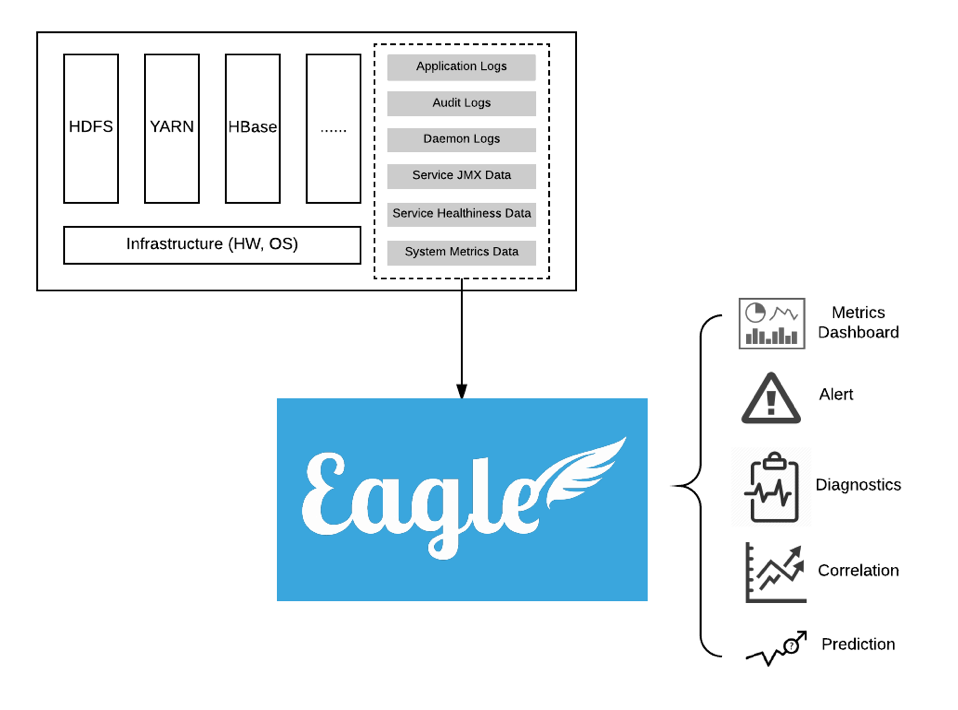

# What is Eagle

** Apache Eagle ** (incubating) is a highly extensible, scalable monitoring and alerting platform, designed with its flexible application framework and proven big data technologies, such as Kafka, Spark and Storm. It ships a rich set of applications for big data platform monitoring, e.g. HDFS/HBase/YARN service health check, JMX metrics, daemon logs, audit logs and yarn applications. External Eagle developers can define applications to monitoring their NoSQLs or Web Servers, and publish to Eagle application repository at your own discretion. It also provides the state-of-art alert engine to report security breaches, service failures, and application anomalies, highly customizable by the alert policy definition. 

## Terminology

### Site

* A virtual concept in Apache Eagle. You can use it to manage a group of application instances, and distinguish the applications if you have a certain application installed for multiple times.

### Application

* Application(or Monitoring Application) is the first-class citizen in Apache Eagle, it stands for an end-to-end monitoring/alerting solution, which usually contains the monitoring source onboarding, source schema specification, alerting policy and dashboard definition.

### Stream

* Stream is the input for Alert Engine, each Application should have its own stream to be defined by the developer. Usually, it will have a POJO-like structure included in the stream definition. Once it's defined, Application should have the logic to write data into Kafka.

### Data Activity Monitoring

* A built-in monitoring application to monitor HDFS/HBase/Hive operations, and allow users to define certain policies to detect sensitive data access and malicious data operations in real-time.

### Alert Engine

* A specific built-in application shared for all other monitoring applications, it reads data from Kafka, and processes the data by applying the policy in real-time manner, and generates alert notification. So we call this application as the Alert Engine.

### Policy

* A rule used by Alert Engine to match the data input from Kafka. Policy is defined in [SiddhiQL](https://docs.wso2.com/display/CEP300/Siddhi+Language+Specification) format.

### Alert 

* If any data input to Alert Engine meets the policy, the Alert Engine will generate a message and publish it through alert publisher. We call such messages as the alerts.

### Alert Publisher

* It will publish the alert to external channels which can be the SMTP channel, the Kafka channel, Slack channel or other storage systems.

## Key Qualities

### Extensible

* Apache Eagle built its core framework around the application concept, application itself includes the logic for monitoring source data collection, pre-processing and normalization. Developer can easily develop his own out-of-box monitoring applications using Eagle's application framework, and deploy into Eagle.

### Scalable

* The Eagle core team has chosen the proven big data technologies to build its fundamental runtime, and apply a scalable core to make it adaptive according to the throughput of data stream as well as the number of monitored applications.

### Real-time

* Storm or Spark Streaming based computing engine allow us to apply the policy to data stream and generate alerts in real-time manner.

### Dynamic

* The user can freely enable or disable a monitoring application without restarting the service. Eagle user can dynamically add/delet/change their alert policies without any impact to the underlying runtime.

### Easy-of-Use

* User can enable the monitoring for a service within minutes effort by just choosing the corresponding monitoring application and configuring few parameters for the service.

### Non-Invasive

* Apache Eagle uses the out-of-box applications to monitor services, you don't need any change to your existing services.

---

# Use Case Examples

## Data Activity Monitoring

* Data activity represents how user explores data provided by big data platforms. Analyzing data activity and alerting for insecure access are fundamental requirements for securing enterprise data. As data volume is increasing exponentially with Hadoop, Hive, Spark technology, understanding data activities for every user becomes extremely hard, let alone to alert for a single malicious event in real time among petabytes streaming data per day.

* Securing enterprise data starts from understanding data activities for every user. Apache Eagle (incubating, called Eagle in the following) has integrated with many popular big data platforms e.g. Hadoop, Hive, Spark, Cassandra etc. With Eagle user can browse data hierarchy, mark sensitive data and then create comprehensive policy to alert for insecure data access.

## Job Performance Analysis

* Running map/reduce job is the most popular way people use to analyze data in Hadoop system. Analyzing job performance and providing tuning suggestions are critical for Hadoop system stability, job SLA and resource usage etc.

* Eagle analyzes job performance with two complementing approaches. First Eagle periodically takes snapshots for all running jobs with YARN API, secondly Eagle continuously reads job lifecycle events immediately after the job is completed. With the two approaches, Eagle can analyze single job's trend, data skew problem, failure reasons etc. More interestingly, Eagle can analyze whole Hadoop cluster's performance by taking into account all jobs.

## Cluster Performance Analytics

* It is critical to understand why a cluster performs bad. Is that because of some crazy jobs recently on-boarded, or huge amount of tiny files, or namenode performance degrading?

* Eagle in realtime calculates resource usage per minute out of individual jobs, e.g. CPU, memory, HDFS IO bytes, HDFS IO numOps etc. and also collects namenode JMX metrics. Correlating them together will easily help system administrator find root cause for cluster slowness.

---

# Disclaimer

* Apache Eagle now is being incubated, and therefore, across the whole documentation site, all appearances of case-insensitive word `eagle` and `apache eagle` represent `Apache Eagle (incubating)`. This could be seen as a part of disclaimer.
