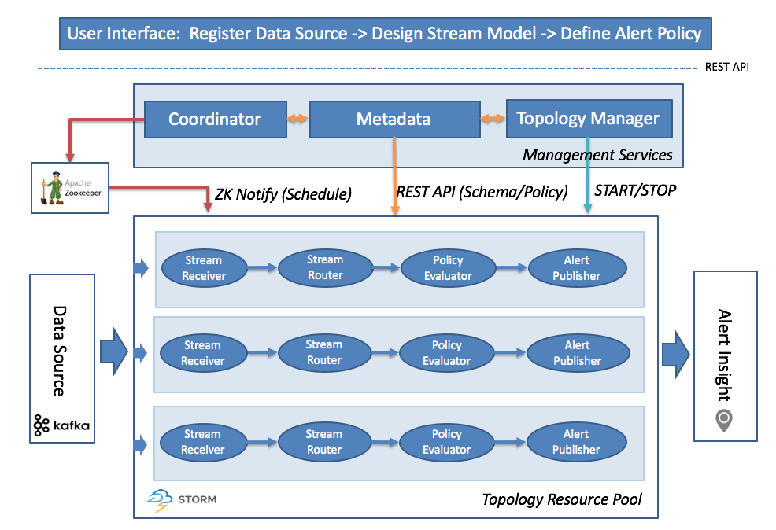
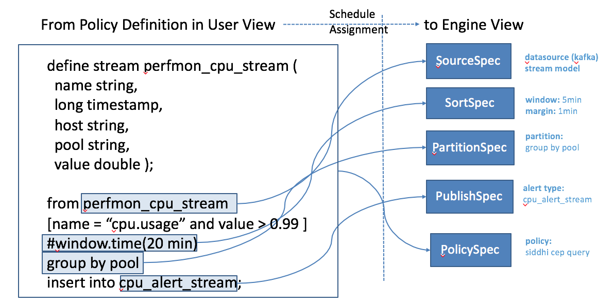
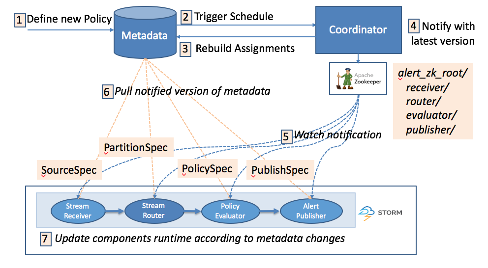
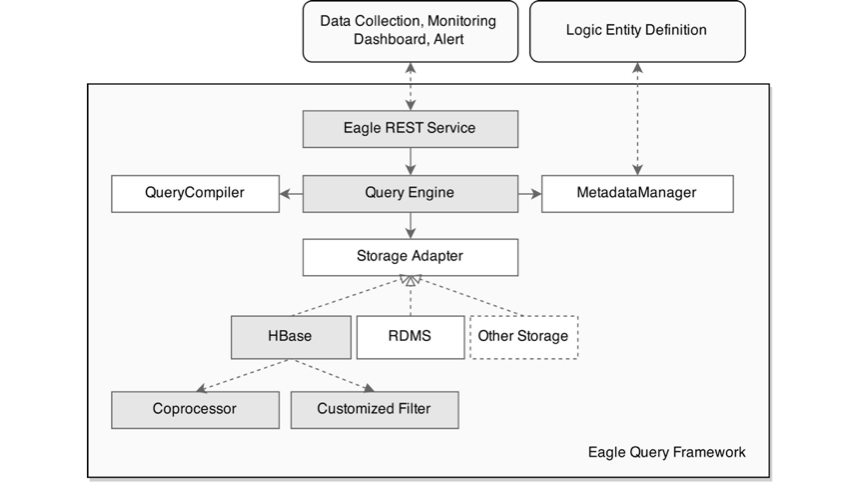

# Alert Engine

### Distributed Real-time Streaming

Eagle Alert Engine is buit on open source realtime streaming infrastrcuture like [Apache Storm](http://storm.apache.org/) as default execution engine and [Apache  Kafka](http://kafka.apache.org/) as default messagig Bus.

### Declarative Policy Evaluator
Eagle supports declarative policy with SQL (CEP) on distributed streaming environment.

Here are some typical examples:

* Example 1: Alert if hadoop namenode capacity usage exceed 90 percentages

		from hadoopJmxMetricEventStream
		[metric == "hadoop.namenode.fsnamesystemstate.capacityused" and value > 0.9] 
		select metric, host, value, timestamp, component, site 
		insert into alertStream;

* Example 2: Alert if hadoop namenode HA switches

	    from every 
		a = hadoopJmxMetricEventStream[metric=="hadoop.namenode.fsnamesystem.hastate"] 
		-> 
		b = hadoopJmxMetricEventStream[metric==a.metric and b.host == a.host and a.value != value)] 
		within 10 min 
		select a.host, a.value as oldHaState, b.value as newHaState, b.timestamp as timestamp, b.metric as metric, b.component as component, b.site as site insert into alertStream;	

### Dynamic Coordinator

# Application Framework

Eagle has multiple distributed real-time frameworks for efficiently developing highly scalable monitoring applications.

## Application

An "Application" or "App" is composed of data integration, policies and insights for one data source.

## Application Descriptor

An "Application Descriptor" is a static packaged metadata information consist of

* __Basic__: type, name, version, description.
* __Application__: the application process to run.
* __Configuration Descriptor____:  describe the configurations required by the application when starting like name, displayName, defaultValue Description, required, etc. which will automatically be visualized in configuration editor.
* __Streams__: the streams schema the application will export.
* __Docs__: application specific documentations which will be embedded in necessary area during the whole lifecyle of application management.

Here is a ApplicationDesc example of `JPM_WEB_APP`

        {
            type: "JPM_WEB_APP",
            name: "Job Performance Monitoring Web ",
            version: "0.5.0-incubating",
            description: null,
            appClass: "org.apache.eagle.app.StaticApplication",
            jarPath: "/opt/eagle/0.5.0-incubating-SNAPSHOT-build-20161103T0332/eagle-0.5.0-incubating-SNAPSHOT/lib/eagle-topology-0.5.0-incubating-SNAPSHOT-hadoop-2.4.1-11-assembly.jar",
            viewPath: "/apps/jpm",
            providerClass: "org.apache.eagle.app.jpm.JPMWebApplicationProvider",
            configuration: {
                properties: [{
                    name: "service.host",
                    displayName: "Eagle Service Host",
                    value: "localhost",
                    description: "Eagle Service Host, default: localhost",
                    required: false
                }, {
                    name: "service.port",
                    displayName: "Eagle Service Port",
                    value: "8080",
                    description: "Eagle Service Port, default: 8080",
                    required: false
                }]
            },
            streams: null,
            docs: null,
            executable: false,
            dependencies: [{
                type: "MR_RUNNING_JOB_APP",
                version: "0.5.0-incubating",
                required: true
            }, {
                type: "MR_HISTORY_JOB_APP",
                version: "0.5.0-incubating",
                required: true
            }]
        }

## Application Provider
	
An "application provider" in fact is a package management and loading mechanism leveraging [Java SPI](https://docs.oracle.com/javase/tutorial/ext/basics/spi.html).

For example, in file 
	
	META-INF/services/org.apache.eagle.app.spi.ApplicationProvider
		
place the full class name of an application provider:

   	org.apache.eagle.app.jpm.JPMWebApplicationProvider

# Metric Storage

## Persistence ORM Framework

Eagle nativelly provides a light-weight ORM Framework for HBase/RDMBS, supporting easily defining persistence data model with java annotation. 

For example as below:

    
    	@Table("HbaseTableName")
		@ColumnFamily("ColumnFamily")
		@Prefix("RowkeyPrefix")
		@Service("UniqueEntitytServiceName")
		@JsonIgnoreProperties(ignoreUnknown = true)
		@TimeSeries(false)
		@Indexes({
			@Index(name="Index_1_alertExecutorId", columns = { "alertExecutorID" }, unique = true)})
		public class AlertDefinitionAPIEntity extends TaggedLogAPIEntity{
		@Column("a")
		private String desc;

## SQL-Like REST Query Language

Eagle provide SQL-Like REST query language on NoSQL Model. For example like

	/rest/entities?query=UniqueEntitytServiceName[@site="sandbox"]{*}

### Eagle Query API

#### List Query 

    ListQuery ::= "/" <EntityName> "?" <KeyValue> { "&" <KeyValue> }
    KeyValue ::= [ <Filter> | <Output> ]
    Filter ::= [ <TagFilter> | <FieldFilter> ]
    Output ::= [ <OuputTag> | <OutputField> ]
    TagFilter ::= "tagNameValue" "=" <Condition> <!= while used in URL, the equal "=" character has to be URL encoded with http://www.w3schools.com/tags/ref_urlencode.asp -->
    FieldFilter ::= "fieldNameValue" "=" <Condition> <!-- not implemented yet, field filter has to be pushed down to hbase column filters -->
    Condition ::= <Identifier> <OP> [ <Identifier> | <RegExpression> ]
    OutputTag ::= <Identifier>
    OutputField ::= <Identifier>
    Identifier ::= <Character> { <Identifier> }
    OP ::= [ "=" | "=~" ] <!-- =~ means regular expression matching, not supported yet as of now -->
    RegExpression ::= <!-- java supported regular expressions http://docs.oracle.com/javase/7/docs/api/java/util/regex/Pattern.html , not yet supported in version 0.9 as of now --> 
    EntityName ::= [ "HdfsService" | "HBaseService" | "MRService" | "Host" | "Disk" | "CPU" | "Config" | "Alert" | "Action" | "Event" | "MRJob" | "MRTask" | "HBaseRPC" | "HdfsRPC" ]

#### Aggregation Query 

    AggregationQuery ::= "/" <EntityName> "?"  <Filter> { "&" <Filter> } "&" <AggregationField> { "&" <AggregationField> } <AggregationFunction> { "&" <AggregationFunction> } [ "&" <AggregationFilters> ]
    AggregationField ::= "gb" "=" <Identifier> 
    AggregationFunction ::= "function" "=" <Identifier>
    AggregationFilters ::= "having" "=" <BooleanExpression>
    BooleanExpression ::= <!-- as of now, boolean expression has not been yet implemented -->

#### Bucket Query 

	BucketQuery ::= "/" <EntityName> "?" <Filter> { "&" <Filter> } "&" <BucketField> { "&" <BucketField> } <BucketLimit> { "&" <BucketLimit> }
	BucketField ::= "BucketField" "=" <Identifier>
	BucketLimit ::= <Number>

#### Rowkey Query 

	RowkeyQuery ::= "/" <RowkeyPath> "?" <KeyFilter> "&' <TableFilter> "&" <ColumnFamilyFilter> "&" [ "all=true" | <FieldSelection> ]
	RowkeyPath ::= "rowkey"
	KeyFilter ::= "key" "=" <Identifier> 
	TableFilter ::= "table" "=" <Identifier>
	ColumnFamilyFilter ::= "cf" "=" <Identifier>
	FieldSelection ::= <Field> { <FieldSelection> }
	Field ::= "Field" "=" <Identifier>
	
#### Pagination
	
	Pagination ::= <CollectionQuery> "&" <PageSize> "&" <StartRowkey>
	PageSize ::= "pageSize" "=" <Number>
	StartRowkey ::= "startRowkey" "=" <Identifier>  <!-- client application should set the rowkey where the query will start with. rowkey should be null if the query starts from the beginning -->

#### Sorting

	Sort ::= [ <AggregationQuery> | <CollectionQuery> ] "&" <SortSpecs>
	SortSpecs ::= <SortSpec> "&" { <SortSpecs> }
	SortSpec ::= "st" "=" <SortField> = <SortOrder>
	SortField ::= <Identifier>
	SortOrder ::= [ asc | desc ]

#### Union

	UnionQuery ::= <Query> { "+" <Query> }  <!-- as of now this syntax is not yet implemented, but union is used by letting service knowing it's a union -->
	Query ::= [ <CollectionQuery> | <AggregationQuery> | <BucketQuery> ] 

#### Join

	JoinQuery ::= <Query> { "^" <Query> } <!-- as of now this syntax is not yet implemented, but union is used by letting service knowing it's a join -->

## HBase Rowkey Design
Optimized Rowkey design for time-series data, optimized for metric/entity/log, etc. different storage types
	
	Rowkey ::= Prefix | Partition Keys | timestamp | tagName | tagValue | …  

#### Metric Rowkey Design

	Rowkey ::= Metric Name | Partition Keys | timestamp | tagName | tagValue | …  

#### Entity Rowkey Design
	
	Rowkey ::= Default Prefix | Partition Keys | timestamp | tagName | tagValue | …

##### Log Rowkey Design

	Rowkey ::= Log Type | Partition Keys | timestamp | tagName | tagValue | …
	Rowvalue ::= Log Content	
### Secondary Index Support

Eagle supports to define secondary index with annotation with `@Index`. For example:
		@Indexes({@Index(name="INDEX_NAME", columns = { "SECONDARY_INDEX_COLUMN_NAME" }, unique = true/false)})
		
### Native HBase Coprocessor
		org.apache.eagle.storage.hbase.query.coprocessor.AggregateProtocolEndPoint

# UI Framework

Eagle UI is mainly consist of following parts:

* Eagle Main UI
* Eagle App Portal/Dashboard/Widgets
* Eagle Customized Dashboard
