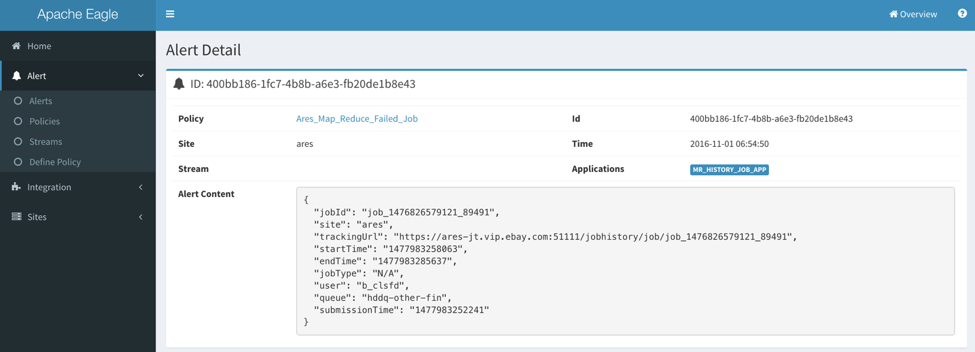

<!--

Licensed to the Apache Software Foundation (ASF) under one or more
contributor license agreements.  See the NOTICE file distributed with
this work for additional information regarding copyright ownership.
The ASF licenses this file to you under the Apache License, Version 2.0
(the "License"); you may not use this file except in compliance with
the License.  You may obtain a copy of the License at

http://www.apache.org/licenses/LICENSE-2.0

Unless required by applicable law or agreed to in writing, software
distributed under the License is distributed on an "AS IS" BASIS,
WITHOUT WARRANTIES OR CONDITIONS OF ANY KIND, either express or implied.
See the License for the specific language governing permissions and
limitations under the License.

-->

# Manage Eagle and Services

* After Apache Eagle has been deployed (please reference [**deployment**](getting-started/#deployment)), you can enter deployment directory and use commands below to control Apache Eagle Server.

		./bin/eagle-server.sh start|stop|status

* After starting the Eagle server, please type http://<EAGLE_SERVER_HOST>:<PORT>/ to open the web ui of Eagle.

---

# Use Eagle Web Interface

* This is the typical Web Interface (short for WI) after setting up your Eagle monitoring environment. WI majorly contain the right main panel and left function menu.

    

## Home

* This is the aggregated UI for configured sites, and the applications. It will show those created sites created, how many application installed for each sites, and alerts generated from that cluster. You can click “More info” link to view the details for particular site.

* The “**Widgets**” section is customizable; if the application developer have its application registered to Home page, you can find that in “**Widgets**” section. Please check the application developer guide about how to register applications to home widgets. It give you a shortcut to go directly to the application home.

## Alert

* In Alert menu, you can define the policies, list the policies and check your alerts there. 

## Integration

* The integration page provides the management functionality for Eagle. You can list the built-in applications there, create sites, and manage the applications in your site.

## Sites

* It also gives you a shortcut to particular site.

---

# Setup The Monitoring Application

## Monitoring Applications

* Eagle has an extensible framework to dynamically add new monitoring applications in Eagle environment. It also ships some built-in big data monitoring applications.

* Go to “**Integration**” -> “**Applications**”, it will list a set of available monitoring applications which you can choose to monitor your services.

    

* The “**Application**” column is the display name for an application, “**Streams**” is a logical name for the data stream from the monitored source after pre-processing, which will consumed by Alert Engine.

* At the moment, we have the below built-in applications shipped with Apache Eagle. You can refer to the application documentation to understand how to do the configuration for each monitoring application.

    | Application | Description |
    | :---------: | :---------: |
    | Topology Health Check | This application can be used to monitor the service healthiness for HDFS, HBase and YARN. You can get alerted once the master role or the slave role got crashed. |
    | Hadoop JMX Metrics Monitoring | This application can be used to monitor the JMX metrics data from the master nodes of HDFS, HBase and YARN, e.g. NameNode, HBase Master and YARN Resource Manager. |
    | HDFS Audit Log Monitor | This application can be used to monitor the data operations in HDFS, to detect sensitive data access and malicious operations; to protect from data leak or data loss. |
    | HBase Audit Log Monitor | Same as HDFS Audit Log Monitor, this application is used to monitor the data operations in HBase. |
    | Map Reduce History Job | This application is used to get the MapReduce history job counters from YARN history server and job running history from HDFS log directory. |
    | Map Reduce Running Job | This application is used to get the MapReduce running job counter information using YARN Rest API. |
    | Hadoop Queue Monitor | This application is used to get the resource scheduling and utilization info from YARN. |
    | MR Metrics Aggregation | This application is used to aggregate the job counters and some resource utilization in a certain period of time (daily, weekly or monthly). |
    | Job Performance Monitor Web | This application only contains the frontend, and depends on Map Reduce History Job and Map Reduce Running Job. |
    | Alert Engine | Alert Engine is a special application and used to process the output data from other applications. |

## Managing Sites

To enable a real monitoring use case, you have to create a site first, and install a certain application for this site, and finally start the application. We use site concept to group the running applications and avoid the application conflict.

### Sites

* Go to “**Integration**” -> “**Sites**”, there will be a table listing the managed sites.

    

### Create Site

* Click “**New Site**” on the bottom right of the Sites page. You can fill the information in site creation dialog.

    

* The “**Site Id**” should not be duplicated. After the creation, you can find it in sites page.

    

### Configuring a Site

* By clicking “**Edit**” button or the Site column in Sites table, you can have the Site configuration page, there you can install monitoring applications.

    

## Install and Run Applications in Site

* Choose the particular application which you want to install, you probably have something to fill, e.g. the HDFS NameNode address, Zookeeper address and port. Please check each application documentation for how to configure each application. 

* After doing the installation, you can start the application by clicking  or stop the application by . You can check the “**Status**” column about the running status. Usually, it should have “**INITIALIZED**” or “**RUNNING**” for a healthy application.

---

# Define Policies

After setting up the monitoring applications, you probably want to setup some alert policies against the monitored data, so you can get notified once any violation on the data. Eagle has a centralized place for policy definition.

## Policies

* Go to “**Alert**” -> “**Policies**”, you can check the policies defined and take control on whether to enable the policy:

    

* You can apply the below actions for a certain policy:

    * : enable a policy

    * : disable a policy

    * : edit a policy

    * : purge a policy

## Define or Edit Policies

* If you want to create a new policy, click “**Alert**” -> “**Define Policy**”, or you can enter into the policy definition page by editing an existing policy. After that, you can go to the policy list to enable the policy dynamically.

    

### Source Stream

* The source stream gives user a full view about what data stream is available for application defined for particular site, as well as the data structures in each data stream. Data stream name is suffixed by the site name.

### Policy Name

* The policy name should be globally unique.

### Publish Alerts

* In this section, you can define the alert publishment method by clicking the “**+Add Publisher**”.

    

* You can choose the publishment method from an existing policy or by creating new publisher. 

* There are four built-in publisher types:

    * **EmailPublisher**: org.apache.eagle.alert.engine.publisher.impl.AlertEmailPublisher

    * **KafkaPublisher**: org.apache.eagle.alert.engine.publisher.impl.AlertKafkaPublisher

    * **SlackPublisher**: org.apache.eagle.alert.engine.publisher.impl.AlertSlackPublisher

    * **EagleStoragePlugin**: org.apache.eagle.alert.engine.publisher.impl.AlertEagleStoragePlugin

### Policy Syntax

* Currently, we support SiddhiQL(please view Siddhi Query Language Specification [here](https://docs.wso2.com/display/CEP300/Siddhi+Language+Specification))

* In order to explain how stream data is processed, let us take policy below as an example:

        from map_reduce_failed_job_stream[site=="sandbox" and currentState=="FAILED"]
        select * group by jobId insert into map_reduce_failed_job_stream_out

* This policy contains below parts:

    * **Source**: from map_reduce_failed_job_stream

    * **Filter**: [site=="sandbox" and currentState=="FAILED"]

    * **Projection**: select *

    * **GroupBy**: group by jobId

    * **Destination**: insert into map_reduce_failed_job_stream_out

* Source Streams(schema) are defined by applications, and applications will write stream data to data sink(currently, we support kafka as data sink).

        <streams>
            <stream>
                <streamId>map_reduce_failed_job_stream</streamId>
                <description>Map Reduce Failed Job Stream</description>
                <validate>true</validate>
                <columns>
                    <column>
                        <name>site</name>
                        <type>string</type>
                    </column>
                    …...
                    <column>
                        <name>jobId</name>
                        <type>string</type>
                    <column>
                        <name>currentState</name>
                        <type>string</type>
                    </column>
                </columns>
            </stream>
        </streams>

* After policy is defined, Alert engine will create siddhi execution runtime for the policy(also load stream data schema from metadata store). Since siddhi execution runtime knows the stream data schema, then it will process stream data and do the calculation.

---

# Monitoring Dashboard

* After setting the sites and applications, you can find the site item from the home page or “Sites” menu.

* Here is a site home example. After entering the site home, the left menu will be replaced by application dashboard links only related to that site, so you can switch between the application dashboard quickly. In the right panel, it contains the application icons installed in this site, but depends on if the application has its dashboard defined. You can click the application icon or the application links to go to the application dashboard home. Please check the application documentation about how to use the application monitoring dashboard.

    

---

# Check The Alerts

* Eagle has all the alerts generated by all the applications stored in its database, so you can check your application alerts from Eagle WI. 

* Go to “**Alert**” -> “**Alerts**”, you can find the alerts table.

    

* Also you can check more detailed information by clicking “**Detail**” link for each alert item.

    

---

# How to stream audit log into Kafka

## Logstash

The sample configuration is tested with logstash-2.3.4. Logstash is required to be installed on the namenode host.

* **Step 1**: Create a Kafka topic as the streaming input.

    Here is an sample Kafka command to create topic 'sandbox_hdfs_audit_log'

        cd <kafka-home>
        bin/kafka-topics.sh --create --zookeeper localhost:2181 --replication-factor 1 --partitions 1 --topic sandbox_hdfs_audit_log

* **Step 2**: Create a Logstash configuration file under ${LOGSTASH_HOME}/conf. Here is a sample.

        input {
              file {
                  type => "hdp-nn-audit"
                  path => "/tmp/test/hdfs-audit.log"
                  start_position => end
                  sincedb_path => "/dev/null"
               }
          }
         output {
              if [type] == "hdp-nn-audit" {
                  kafka {
                    codec => plain {
                        format => "%{message}"
                    }
                    bootstrap_servers => "host:9092"
                    topic_id => "hdfs_audit_log"
                    acks => "0"
                    timeout_ms => 10000
        
                    send_buffer_bytes => 102400
                    client_id => "hdp-nn-audit"
        
                    workers => 10
                    compression_type => "gzip"
                 }
                  # stdout { codec => rubydebug }
          }
        }
        
* **Step 4**: Start Logstash

        bin/logstash -f conf/sample.conf

* **Step 5**: Check whether logs are flowing into the kafka topic specified by `topic_id`

## Filebeat 

The sample filebeat.yml is tested with filebeat-5.0.0-beta1-linux-x86_64. The throughput can be up to 20K messages per second. Filebeat is required to be installed on the namenode host.

        filebeat.publish_async: false
        filebeat.spool_size: 8192
        filebeat.idle_timeout: 5s
        max_procs: 1
        queue_size: 1000

        filebeat.prospectors:
        - input_type: log
          paths:
             - /tmp/test/hdfs-audit.log
          #tail_files: true
          harvester_buffer_size: 8192

        output.kafka:
          enabled: true
          hosts: ["host:9092"]
          topic: "phx_hdfs_audit_log"
          client_id: "client-host"
          worker: 10
          max_retries: 3
          bulk_max_size: 8192
          channel_buffer_size: 512
          timeout: 10
          broker_timeout: 3s
          keep_alive: 0
          compression: none
          max_message_bytes: 1000000
          required_acks: 0
          flush_interval: 1

        logging.metrics.period: 10s

        processors:
          - include_fields:
             fields: ["message", "beat.hostname"]

## Log4j Kafka Appender

This sample configuration is tested in HDP sandbox. `Restarting namenode is required` after updating the log4j configuration. 

* **Step 1**: Create a Kafka topic. Here is an example Kafka command for creating topic "sandbox_hdfs_audit_log"

        cd <kafka-home>
        bin/kafka-topics.sh --create --zookeeper localhost:2181 --replication-factor 1 --partitions 1 --topic sandbox_hdfs_audit_log

* **Step 2**: Configure $HADOOP_CONF_DIR/log4j.properties, and add a log4j appender "KAFKA_HDFS_AUDIT" to hdfs audit logging

        log4j.appender.KAFKA_HDFS_AUDIT=org.apache.eagle.log4j.kafka.KafkaLog4jAppender
        log4j.appender.KAFKA_HDFS_AUDIT.Topic=sandbox_hdfs_audit_log
        log4j.appender.KAFKA_HDFS_AUDIT.BrokerList=sandbox.hortonworks.com:6667
        log4j.appender.KAFKA_HDFS_AUDIT.KeyClass=org.apache.eagle.log4j.kafka.hadoop.AuditLogKeyer
        log4j.appender.KAFKA_HDFS_AUDIT.Layout=org.apache.log4j.PatternLayout
        log4j.appender.KAFKA_HDFS_AUDIT.Layout.ConversionPattern=%d{ISO8601} %p %c{2}: %m%n
        log4j.appender.KAFKA_HDFS_AUDIT.ProducerType=async
        #log4j.appender.KAFKA_HDFS_AUDIT.BatchSize=1
        #log4j.appender.KAFKA_HDFS_AUDIT.QueueSize=1

* **Step 3**: Edit $HADOOP_CONF_DIR/hadoop-env.sh, and add the reference to KAFKA_HDFS_AUDIT to HADOOP_NAMENODE_OPTS.

        -Dhdfs.audit.logger=INFO,DRFAAUDIT,KAFKA_HDFS_AUDIT

* **Step 4**: Edit $HADOOP_CONF_DIR/hadoop-env.sh, and append the following command to it.

        export HADOOP_CLASSPATH=${HADOOP_CLASSPATH}:/path/to/eagle/lib/log4jkafka/lib/*

* **Step 5**: save the changes and restart the namenode.

* **Step 6**: Check whether logs are flowing into Topic sandbox_hdfs_audit_log

        $ /usr/hdp/current/kafka-broker/bin/kafka-console-consumer.sh --zookeeper localhost:2181 --topic sandbox_hdfs_audit_log
